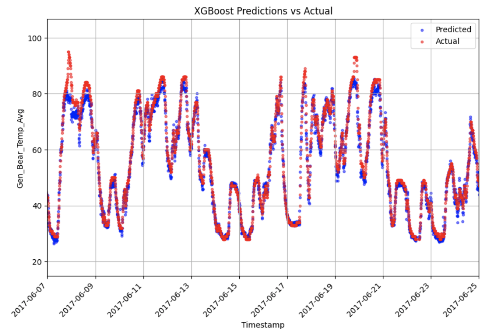

# Predictive maintenance modeling on a wind turbine bearing

By Magnus S. Nordeide, Markus A. Y. Thorsnes, 21.04.2024

# Introduction

Predictive maintenance is an emerging field where the goal is to save resources and money on maintenance of components by using a conditional maintenance program instead of a traditional time based maintenance program. 

Machine learning opens the possibility to predict when a fault is going to happen, before it happens, by using past sensor data and past failure data. 

Some of the issues on predictive maintenance involve applying past data correctly and in an informative manner, and properly understanding and making decisions based on the information given by the outputs of the models. 

This project is a case study where the goal is to apply different machine learning techniques and models in order to predict the temperature of a wind turbine bearing by using sensor data. 

# Part 1: Understanding Maintenance

There are three main maintenance programs that are commonly discussed: 

1) Preventative maintenance, 2) Reactive maintenance, 3) Predictive maintenance. See figure 1.
   
Preventive maintenance is the act of replacing a component before an increased degradation state of the component has started. This maintenance program is a static time-interval based maintenance program. 

Reactive maintenance consists of replacing components after failure has occurred. This usually leads to huge monetary losses.

Predictive maintenance aims to make an informed decision on the maintenance event based on the condition of the equipment to avoid failure or prematurely replacing the component.

Traditionally the maintenance is done reactively or preventatively, so the challenge here is to improve this process by seeing the failure in advance and doing maintenance before failure occurs.

Alot of methodology is improving rapidly due to the current focus on machine learning in general. However, as a whole the field does not rely on only machine learning, but utilizes other models such as physical and statistical models. In addition hybrid models are researched. Predictive maintenance extends into the field of prognostics health management where the decisions for maintenance is the focus. This is where predictive maintenance metrics are used to actually plan maintenance events.

Figure 1: Cost increase with reactive maintenance [2]

# Part 2: Predictive maintenance in action: Case studies and experiments

## Methodology

Our project will be based on a quantitative methodology. For this project we will be using publicly available wind turbine data from a spanish company named EDP. The data consists of six datasets:

* 2016 sensor readings from 55 different sensors on all wind turbines. 
* 2017 sensor readings from 55 different sensors on all wind turbines. 
* 2016 Onsite weather data
* 2017 Onsite weather data
* 2016 Failure data
* 2017 Failure data

The data is formatted so that we have an average, a max and a min value for a certain time interval in the data. So it's not totally raw, and has been pre processed in some way beforehand. The datetime is included in the dataset also. The first step of the project was to get a feel for the data and open it in python. In Notebook_blogpost_tabular_data.ipynb the exploration of the data is done in a systematic way to get a feel for the data, and familiarize it to working with the models. Later separate models were created.

In this project we will use linear regression, random forest, XGBoost and neural networks for modeling of the prediction. This way we get a good feel for the different machine learning models that are often associated with tabular learning. 

For selecting case studies and experiments on predictive maintenance it’s important to have information on when failures have occurred in the past. In our case, it doesn’t hurt too much to not have it, because we are not taking the model to decision-level, but we want to model the behavior of some component such that when our prediction deviates from the actual sensor readings, we can assume that it’s breaking. 

## Case studies

Wind turbines are subject to wear, tear and degradation during their lifetime. A turbine bearing is a component in which regular maintenance occurs. In our study we want to monitor the state of a turbine bearing. 

Temperature is commonly known to be a health indicator for bearings, as an increase in bearing temperature is often associated with bearing failure. One of the sensor data readings in the dataset is temperature data on the generator's shaft bearing. This will be our dependent variable that we want to predict, based on inputs such as temperatures of other components, RPM, wind speeds etc. 

For our case study we therefore want to predict the temperature of a bearing in one of EDP’s turbines off the coast of Africa. Our goal is to accurately model the bearing temperature using different machine learning models, and then comparing them by using the root mean square error metric.

In our case study we are focusing on wind turbine number 7, due to one available failure data there which occurred in 2017

Linear regression and XGBoost was trained for the whole of 2016, and the model was validated on an interval before the failure of the generator occurred, in 2017. Random forest and neural network was trained for 66% of 2016 data, validated on 33% of 2016 data, and tested on 2017 data. The reasoning for that choice is because the study that we are basing this work upon chose that split. 

## Results

Table 1: RMSE of the models on the testset. 

Figure 2: XGBoost prediction compared with the actual measurement from the sensor at the time where right before failure. Notice how they deviate in the tops. This indicates that the bearing is unhealthy

# Part 3: Implications and future directions
Future DAT255 projects related to predictive maintenance can implement different types of models. Examples can be to do something with vibration data to use. It would also be interesting to see how many timesteps into the future one could return accurately by returning multiple temperatures rather than one. It's also possible to go further into the models themselves to evaluate why performance differs and how one can leverage for example deep learning as efficiently as possible.

Further work would also include making conditional functionality based on the deviation of predicted temperature values and actual temperature values. Ultimately, we want to predict when a bearing is going to fail. This would require implementing a threshold and some sort of conditional scheme. For example, if the temperature of the bearing is high AND a deviation threshold is met, we want to take action, and trigger scheduling of maintenance events. This would require further planning and work. 

For data processing and machine learning, future research could include using other ways to represent data and predict temperatures. Methods like sliding windows to continuously predict future temperatures, or converting the timesseries to spectograms and use deep neural networks for image classification, could be explored.

## Discussion
Our results show that even the most basic approaches do work for our one validating failure. However, this is important to note that the models should be tested for multiple scenarios as failures occur on the turbine.

An important result is that the deviation between the measured temperature and the prediction is observable. This is important because it indicates that we are doing the correct method of measuring to capture the degradation. The models could be state of the art, but if the sensors don’t act as a health indicator for what we are trying to analyze we are left with no usable result. 

Improvements to the model are still possible, and there are things that can be further explored. We only used the data from one turbine for training while there are many from the same wind farm available in the same dataset. However, it's not certain that this will lead to better results because it would mean training on a more general basis than if it's the exact same turbine that is the goal of being predicted. If the goal is to have a more robust model though. This can be a good idea.

There was an expectation that the XGBoost model would outperform the other models based on the previous research. However, it did not perform as good as expected.

When it comes to splitters, there may also be a possibility to capture more of the seasonal effects from time series if one trains on more data. Right now the models are mostly trained on 2016 data and that data is split, so the model was not trained on a full year. In the process of the project, this was tested once, and appeared to actually reduce the accuracy just a little bit, which was opposite of the hypothesis for that scenario.

The plan was also to use a tool called DBScan to clean the data with a domain knowledge standpoint. We don’t want to include data where the sensor was damaged or the wind turbine out of service. As it stands, these factors all impact the accuracy of the model’s predictions. Neural networks are especially sensitive to long tail distributed data, which we see the 2016 training has due to sensor failure. 

Figure 3: Actual training data (in blue) and prediction (in orange). From the random forest model. We can see how faulty sensors impact the data that’s being trained on.

While cleaning the data for the random forest implementation slightly worsened the RMSE of the training and validation set, it should make the model more robust to timesseries changes and variations. As a result, predictions made about the bearing temperature as time goes will be more accurate relative to predictions made when not cleaning the data.

## Conclusion
The conclusion of the project is that with implementation of machine learning models it is possible to make a predictor for the temperature of a bearing and validate the model against the sensor. Out of the models we tested, a random forest performed best for this case. However, it's also important to note that further work must be done to ensure consistency in the result. 

Deep models and more advanced techniques can be utilized to capture specific elements within the data. More specifically non-linear relationships between the data. Domain knowledge can also affect the choice of models because one might use mathematical relationships as a foundation for the choice of data to use to ensure one captures the right data like in [1]. 

# Bibliography:

[1] O. T. Bindingsbø, M. Singh, K. Øvsthus, og A. Keprate, «Fault detection of a wind turbine generator bearing using interpretable machine learning», Front. Energy Res., bd. 11, s. 1284676, des. 2023, doi: 10.3389/fenrg.2023.1284676.

[2] R. Siraskar, S. Kumar, S. Patil, A. Bongale, og K. Kotecha, «Reinforcement learning for predictive maintenance: a systematic technical review», Artif Intell Rev, bd. 56, nr. 11, s. 12885–12947, nov. 2023, doi: 10.1007/s10462-023-10468-6.

